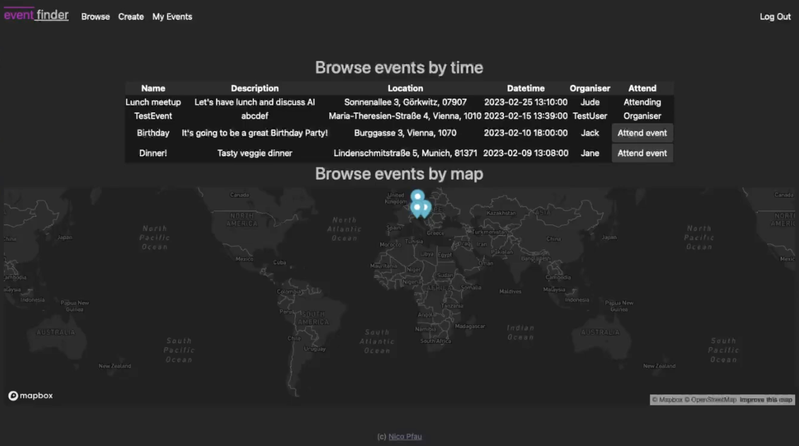

# EventFinder

A social event finder web application, where users can create and join events, and view them on a map.
Final project for [CS50x's Introduction to Computer Science](https://cs50.harvard.edu/x/2022/)

#### Video Demo
[Youtube](https://www.youtube.com/watch?v=uQBHK3bsfG8)
### Description
##### General description
EventSharer allows you to register, login and logout with username, email address, and password (that will be hashed).
Once registered and logged in, users are able to create events (incl name, description, date + time, location), that will then be visible to other users, in table view and on a map. Other users are able to join and 'exit' such events. Functionality is partly supported by MapBox APIs.

##### Functionalities
- Register, login, logou
- The 'browse' menu allows you to view events ordered by time and join them, and also on a map view (MapBox API key needed - see below).
- The 'create' page allows a user to create his or her own events.
- The 'my events' page allows you to view and delete your own events, and view and 'exit' events that you joined.
- The 'logout' page allows you to logout.

###### Potential future functionalities
- Add user profiles
- Add a 'search' functionality
- Add a comment section for each event
- Add private/public events
- Improve map view
- Improve test coverage

##### File structure
- app.py - the main file, containing the Flask app and the routes
- db_helpers.py - contains the functions that interact with the database
- helpers.py - contains helping functions that are used in the routes
- tests/app_test.py - contains some basic tests
- templates - contains the html files
    - template.html - the base template
    - index.html - the home page
    - login.html - the login page
    - register.html - the register page
    - browse.html - the browse page to view events on a map and in a table
    - create.html - the create page to create an event
    - my_events.html - the my events page to view and delete your own events, and view and 'exit' events that you joined
    - apology.html - the error page
- .env.example - contains the environment variables example
- static - contains the css
    - style.css - the css file
- requirements.txt - contains the Python requirements

##### Database
- The database and database tables are created when running the app for the first time.
- The database is a Sqlite3 database, with 3 tables: users, events, and event_users.
- The users table contains the user's id, username, email, and password (hashed).
- The events table contains the event's id, name, description, date, time, location, and user_id (the user who created the event).
- The event_users table contains the event_id and user_id (the user who joined the event).

##### Security
- Passwords are hashed using Werkzeug's generate_password_hash() function.

##### Testing
- The app is tested using Pytest.
- The tests currently only cover the basic main pages.

##### Technologies used
- HTML
- CSS
- JavaScript 
- Sqlite3 (database)
- Python (Flask, Jinja2, Werkzeug)
- MapBox API (for map view and autocomplete)
- Pytest (for testing)

##### How to run
- Clone the repository
- Install the requirements (pip install -r requirements.txt)
- Set the environment variables (see below)
- Run the app (flask run)

##### Environment variables
- You need to get a MapBox API key (https://www.mapbox.com/)
- MAPBOX_TOKEN (MapBox API key) - needed for map view and autocomplete
- Set the key in the .env file (see .env.example)
